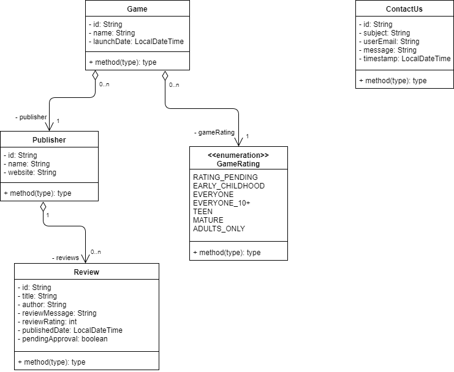

# APAW. ECP2. Arquitecturas y Patrones Web
> Este proyecto es un ejercicio de arquitectura de un API-REST simulado para comprender las capas que intervienen y la organización de los diferentes tipos de test, con integración continua y control de la calidad del código.
> ##### [Máster en Ingeniería Web por la Universidad Politécnica de Madrid](http://miw.etsisi.upm.es)
> ##### Asignatura: *Arquitectura y Patrones para Aplicaciones Web*

## Tecnologías necesarias
* Java
* Maven
* GitHub
* SonarCloud

## Diseño de entidades

## API

### POST /publishers
#### Parámetros del cuerpo
- `name`: String (**requerido**)
- `website`: String

#### Respuesta
- 200 OK 
  - `dtoId`: String
- 403 BAD_REQUEST

---

### GET /publishers/{dtoId}
#### Respuesta
- 200 OK 
  - `{name:String,website:String}`: String
- 403 BAD_REQUEST
- 404 NOT_FOUND

---

### POST /publishers/{dtoId}/games
#### Parámetros del cuerpo
- `name`: String (**requerido**)
- `publisher`: Publisher (**requerido**)
- `launchDate`: LolcalDateTime
- `gameRating`: String

#### Respuesta
- 200 OK 
  - `dtoId`: String
- 403 BAD_REQUEST

---

### PATCH /publishers/{dtoId}/games/{dtoId}/name
#### Parámetros del cuerpo
- `name`: String (**requerido**)

#### Respuesta
- 200 OK 
- 403 BAD_REQUEST
- 404 NOT_FOUND

---

### POST /publishers/{dtoId}/reviews
#### Parámetros del cuerpo
- `dtoReviewMessage`: String (**requerido**)
- `dotTitle`: String
- `dtoAuthor`: String
- `dtoPendingApproval`: Boolean

#### Respuesta
- 200 OK 
  - `dtoId`: String
- 403 BAD_REQUEST

---

### PUT /publishers/{dtoId}/reviews/{dtoId}
#### Parámetros del cuerpo
- `dtoReviewMessage`: String (**requerido**)
- `dotTitle`: String
- `dtoAuthor`: String
- `dtoPendingApproval`: Boolean

#### Respuesta
- 200 OK 
- 403 BAD_REQUEST
- 404 NOT_FOUND

---

### DELETE /publishers/{dtoId}/reviews/{dtoId}
#### Respuesta
- 200 OK 

---

### GET /publishers/search?q=gameRating:{GAMERATING}
- 200 OK 
  - `[{dtoId:String,name:String,publisherName:String,launchDate:LocalDateTime}]`
- 403 BAD_REQUEST
